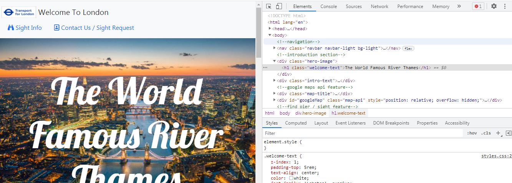
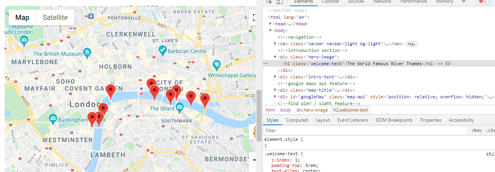
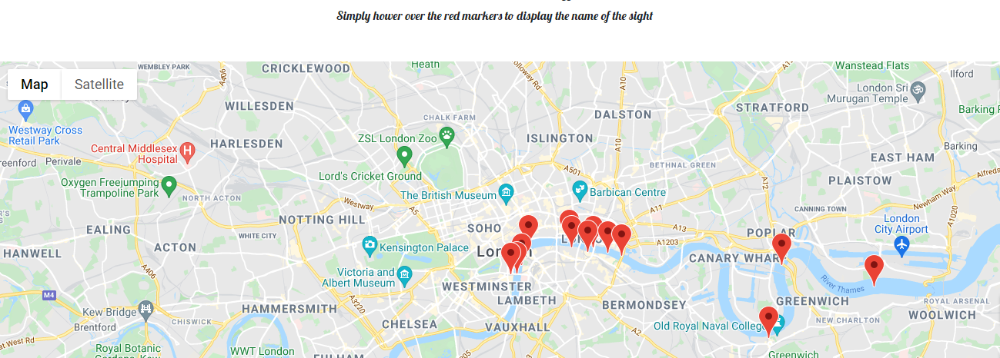
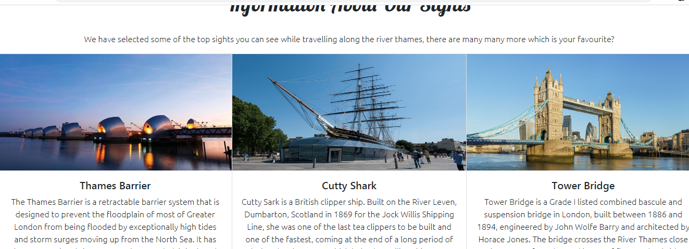

# milestoneProject2
Code Institute Milestone Project 2

Here is a link to the live project.

This website has been created as part of a Code Institute course. (Diploma in software development) This project is is my milestone two interactive frontend development project. My project has been designed to attract tourist to visit London and in particular to encourage tourist to visit the river thames.

## Main objective of project

The main purpose of this project is to show potential tourist or visitors what sights and attraction london and the river thames has to offer. I have used HTML CSS and JavaScript coding to display the website content. I have implemented many features to allow the user to interact with the webpage and enjoy a good user experience.

#### Main Goals

- Show off what london and the river thames has to offer
- Provide potential tourist / visitors with information about sights
- Provide potential tourist / visitors with information on how to see the sights
- Allow the users to interact with the site
- Encourage potential tourist / visitors to visit the river thames

### Project Design

I firstly desgined my project layout via wireframes to get a picture of how my finished project would look. My final design has changed slightly from intial design, however I am happy with the final design and outcome.

When carrying out research before starting this project I viewed many tourist / visitor sites and found them to be full of information, however these sites did not provide in detail information about specific sights etc. Therefore I decided to focus on one part of london (river thames). I then decied to provide as much detail about the river and the sights avaliable without filling the page with text which the user would most likely ignore.

The project was mostly built with bootstrap to allow for easy of ease of design and to allow the page to be responsive.

### Features

* Responsive design when viewed on tablet, desktop or mobile device
* Google maps api allowing the user to use a google maps and street view direct on the page
* Sights displayed on google map on page allowing user to see exact location of sight
* find pier function allowing the user to select which sights they want to see and which pier they need to go to 
* Contact us form to allow the user to request sight upload or just general enquiry
* Email news letter sign up

### Home Page

The home page of my project includes a navigation section at the top to allow the user to navigate around the page with ease and to find the information they are looking for quickly. This page also includes a brief introduction on what the page is for / about along with two images which are hidden when viewed on a mobile device.

The google maps api is displayed on the home page bause I did not want the user to have to search for this feature. I wanted this to be a feature they come across straight away when viewing the page to prevent the leaving the page without using / seeing this feature. The feature displays an interactive map and displays a few of the seclected sights highlighted with markers and labels. This allows th user to find the exact location of the sights, the locations of the sights are marker via the lat/lng position therefore are esact locations.

The next feature on the home page is the find pier function, this function allows the user to select the sights they want to see and when the function is run via the "find Pier" button a resulting pier will be displayed informaing the user which pier they need to access.

### Contact Us Page

The contact us page features a contact form allowing the user to request a sight to be uploaded or request more information about a sight, the user can also submit a general enquiry. The form is coded to send the owner of the web page an email using the JavaScript code from email.js

The rest of the contact page has a brief introduction about the page and a few images to present the webpage professionally.

### Sight Info Page

The sight info page has all the infoamtion about the sights that are displayed on the google map, each sight has a brief description about the sight. I wanted to keep the description to two or three sentenaces as a big block of text is often over looked by the user. 

I user the boostrap card feature to display the sights cleaning and also this makes the diplay responsive exactly how I planned in my wireframe.

### Footer

The footer is consistance across the webpage, the footer was user from boostrap again to create a very professional display.This footer is also responsive and changes display depending on which device you view the page on.

### Features To Add

There are a couple of features I would like to add in future to make the page better. Firstly I would like to change the find pier function to diplay more information and to allow the user to select more than one sight at a time.

Secondly I would like to change the google map displaying the sight markers to dispaly more information about the sights. I would also like to add a link to the sight info page to take the user to the sight information about the sight they have selected.

### Devices

I then opened the project on as many devices as I could get my hands on just to double check display of the project on different devices.

Devices Used: - iphone 8 - iphone 11 - hp pavilion g series laptop - hp laptop With the project opened on each device I checked:

- All images loaded correctly All images appeared correctly (not stretched out or squashed up)
- All links worked correctly
- All links navigate to correct section
- All social links open in new window
- Load time of page
- When page refreshed the load time is not too long to avoid a bad user experience
- Form works correctly (submitting correct data)
- When form filled out the correct data was submitted
- The field required warning works correctly on each field
- JavaScript functions correctly

### Testing

Throughtout designing and building my project I have used Devtools in the Chrome browser, this allows me to see how each element is being displayed and changes can be made. 

### Built Width:

- Bootstrap 4 (v4)
https://getbootstrap.com/
Used for initial layout before customizing to my exact needs requirements.
- Google Fonts
https://fonts.google.com/
Fonts imported to give the exact presentation required
- Font Awesome
https://fontawesome.com/
Used to import various icons throughout the project
- Git Hub
https://github.com/
Used for creating repository, storing code and deploying project.
- Git Pod
https://www.gitpod.io/
Used to create code, edit code and version control.
- Email.js
https://www.emailjs.com/
Used to enable the feature to allow the user to send contact form directly to owner.

### Problems Encountered

I encountered a couple of problems while designing and building my project. Firstly as this was my first time using the google maps api I encoutered problems when trying to set up my account and use the api correctly. I over come this problem via advice from my mentor, slack and reading the documentation on google.

Secondly, my design clashed when viewed on mobile or tablet devices. This problem was easily overcome via media queries.

### User Stories

As a potential new user to this webpage I want to be able to navigate the page quickly and find information fast.  
Screen shot shows navigation bar at top of page, allowing the user to quickly access all pages of sight and find required information.
   

As a potential new visitor to the page I want to interact with the page to enable a good user experience.  
Screen shot shows interactive map on page.  
   

As a potential new visitor to London or the thames river I want to be able to find information about avaliable sights.   
Screen shot shows page dedicated to information about sights.   
   

As a returning visitor to the page or to London I want to be able to keep up to date with whats new on the page.  
Screen shot shows feature allowing the user to sign up to an email newsletter.  
   

As a potential new vistor to London I want to be able to find information about how to access the sights advertised.   
Screen shot shows find pier feature.   

## Contributing:
To contribute to this project follow these steps:

- Fork this repository.
- Create a branch.
- Make changes and commit them.
- Push to the original branch.
- Create a pull request. Alternatively see the documentation on GitHub.
- Deployment
- To deploy this project in Github pages from the repository https://github.com/Jack-19/milestoneproject-car in Github:

- Login to Github
- Choose correct repository (Jack-19/milestoneproject-car)
- Next select settings from the top of the page
- Find Github pages
- click source drop down menu
- Select master branch
- Once master branch is selected the project is now deployed
- Scroll back to Github pages to find the website link
(https://jack-19.github.io/milestoneproject-car/)

#### Run project locally

A Githubaccount will be required
Use a supported browser
- Add Gitpod browser extention
- Restart browser
- Log on to Gitpod
- Find the project on Git Hub
This will open Gitpod with code to allow you to work locally

#### Credits:
- Bootstrap
- Code Institute
- Youtube
- Google Fonts
- Font Awesome
- Git Pod
- Git Hub
- Slack
Contributors:
Jack Smith
total90-@hotmail.com
https://github.com/Jack-19

## Contact:
Jack Smith
total90-@hotmail.com
https://github.com/Jack-19
